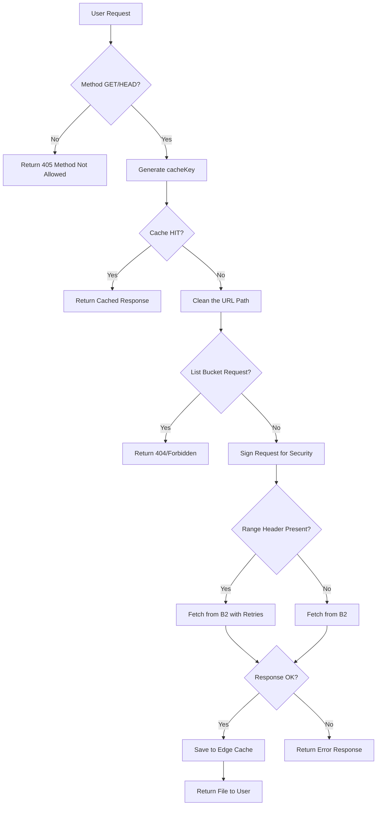
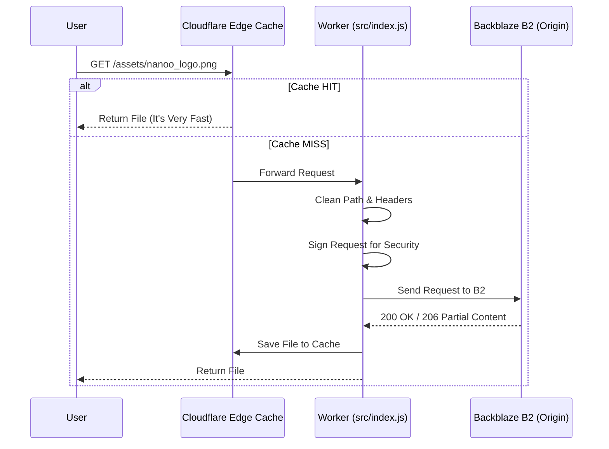

# Nanoo CDN Architecture

This document shows how the system works and how requests move through it, maybe in the future there will be improve

## How the worker processes a request

This diagram shows the steps the Worker takes for each new request. It also shows how the cache helps to make it faster.

## Step by step request flow

This diagram shows how the User, Cloudflare, and backblaze B2 talk to each other.

## Project Parts

- **`src/index.js`**: **Main controller**
- **`src/lib/signer.js`**: **Security handler**
- **`src/lib/cache.js`**: **Speed manager**
- **`src/lib/utils.js`**: **Helper tools**
