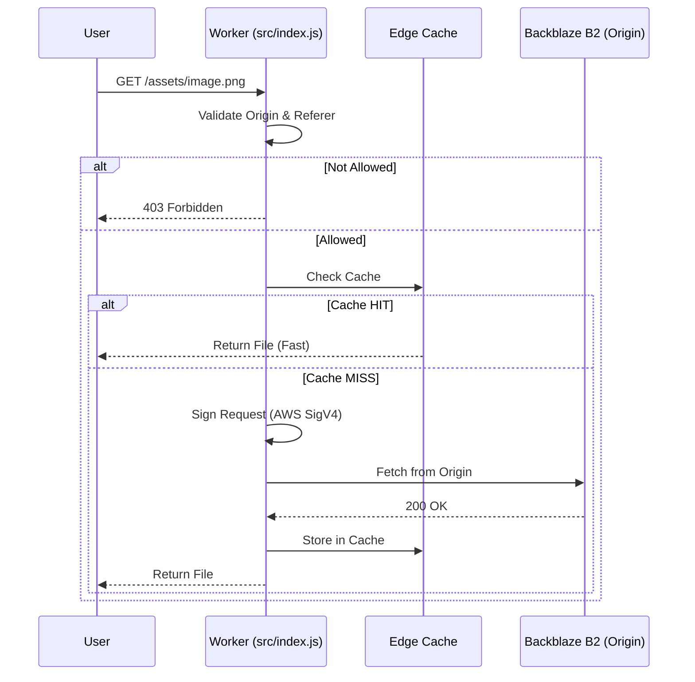

# Nanoo CDN Architecture

This document shows how the system works and how requests move through it, maybe in the future there will be improve

## How the worker processes a request

This diagram shows the steps the Worker takes for each new request. It also shows how the cache helps to make it faster.

```mermaid
graph TD
    A[User Request] --> B[Sanitize Path]
    B --> C{Origin/Referer Allowed?}
    C -- No --> D[Return 403 Forbidden]
    C -- Yes --> E{Method OPTIONS?}
    
    E -- Yes --> F[Return CORS Preflight]
    E -- No --> G{Root Path /?}
    
    G -- Yes --> H[Return Home Page]
    G -- No --> I{Method GET/HEAD?}
    
    I -- No --> J[Return 405 Method Not Allowed]
    I -- Yes --> K[Check Edge Cache]

    K -- HIT --> L[Return Cached Response]
    K -- MISS --> M{List Bucket Request?}
    
    M -- Yes --> N[Return 404 Not Found]
    M -- No --> O[Sign Request (SigV4)]
    
    O --> P[Fetch from B2 Origin]
    P --> Q{Response OK?}
    
    Q -- Yes --> R[Save to Cache & Return File]
    Q -- No --> S[Return 404 Error Page]
```

## Step by step request flow

This diagram shows how the User, Cloudflare, and Backblaze B2 talk to each other.



## Project Parts

- **`src/index.js`**: **Main controller**
- **`src/lib/signer.js`**: **Security handler**
- **`src/lib/cache.js`**: **Speed manager**
- **`src/lib/utils.js`**: **Helper tools**
